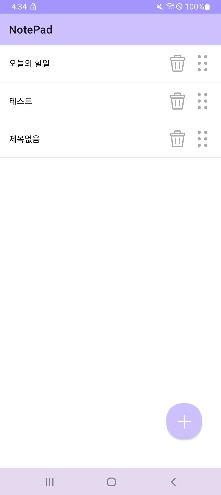
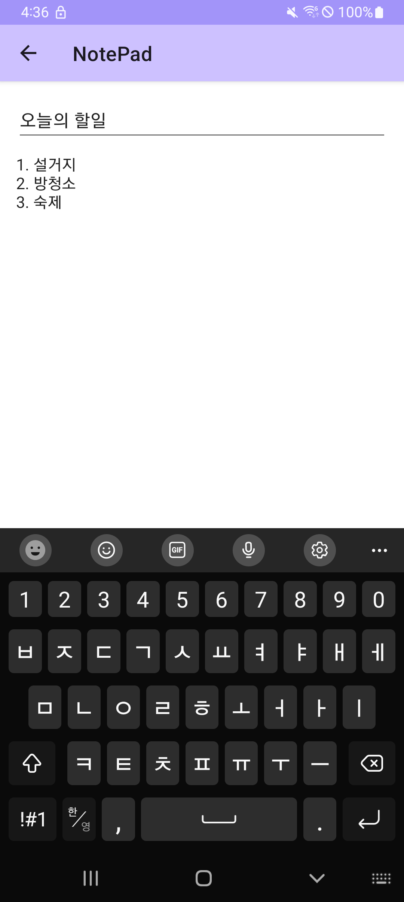

# NotePad - 메모장

이 앱은 Android Studio를 이용해 개발한 간단한 메모장 앱으로, 사용자가 메모를 작성하고, 수정하고, 삭제할 수 있는 기능을 제공함. 직관적인 사용자 인터페이스로 편리하게 메모를 관리할 수 있음.
 
 

## 개발 환경

- **Android Studio**: Ladybug | 2024.2.1 Patch 3
- **Gradle**: 8.9
- **kotlin**: 1.9.24

## 모바일에서 실행 방법
- Releases에 있는 임의의 버전 apk 다운 받아서 휴대폰에 전송하여 다운로드 및 실행

## 기능

앱은 다음과 같은 기능들을 제공함:

- **메모 추가** : 새로운 제목과 내용을 입력하여 메모를 추가할 수 있음.
- **메모 수정** : 기존의 메모를 선택하여 제목과 내용을 수정할 수 있음.
- **메모 삭제** : 메모를 삭제할 수 있음.
- **메모 드래그** : 메모를 위 아래로 움직여 원하는 자리에 배치할 수 있음.
- **메모 저장** : 변경 내용을 자동으로 저장함.

## Preview
 

  
  

 

## 참고사항
- recyclerView로 메모 목록 구현
- sharedPreference를 이용해 저장 및 불러오기
